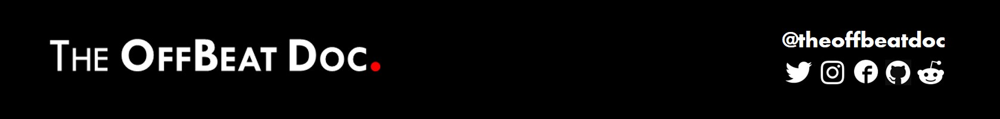

<!--

Here are some ideas to get you started:

- 🔭 I’m currently working on ...
- 🌱 I’m currently learning ...
- 👯 I’m looking to collaborate on ...
- 🤔 I’m looking for help with ...
- 💬 Ask me about ...
- 📫 How to reach me: ...
- 😄 Pronouns: ...
- ⚡ Fun fact: ...
-->

<!--p style="align:centre"></p-->

#### 👉 [theoffbeatdoc.github.io](https://theoffbeatdoc.github.io) 👈

<h1> Hey, I'm Koustav!</h1>

>>Living, Aspiring, Exploring...

  - 🩺 **Medical Student at Calcutta National Medical College, Kolkata, India**
  - ☕ **Programmer (afterall it's Github XD)**
  - 🎧 **DJ & Electronic Music Producer.**

### 🤔 Medicine vs Coding
I code because I love programming! At the same time I believe working on AI Healthcare projects being a doctor would be great. So, I would definitely pursue Medicine as well as hold onto my passion for coding. Also, I'd like more people to embrace modern technology to keep healthy and improve their lifestyle. That's why I've also decided to write articles on medicine, technology, lifestyle and beyond.

### 📝Recent Blogs

<!-- BLOG-POST-LIST:START -->
- [How Artificial Intelligence (AI) will cause an Evolution in Classical Medicine and Healthcare?](https://theoffbeatdoc.blogspot.com/2021/06/AI-Evolution-Healthcare.html)
<!-- BLOG-POST-LIST:END -->

 <!--a target="_blank" href="https://github-readme-medium-recent-article.vercel.app/medium/@theoffbeatdoc/0"> 

